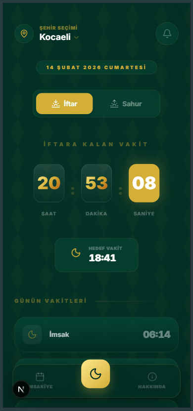

# İftar Vakti Pro

Modern, şık ve premium bir PWA uygulaması ile iftar, sahur ve namaz vakitlerini anlık takip edin. [systemconf](http://systemconf.online) tarafından geliştirilen bu proje, geleneksel İslami estetiği modern teknolojiyle birleştirir.

---

[English Version (README-EN.md)](README-EN.md) | [Canlı Demo](https://iftarvaktipro.systemconf.online)

---


[](https://iftarvaktipro.systemconf.online)

## Öne Çıkan Özellikler

### Sacred Heritage Tasarımı
Uygulama, "Sacred Heritage" (Kutsal Miras) adını verdiğimiz özel bir tasarım diline sahiptir. Zümrüt yeşili ve altın sarısı tonları, arabesk geometrik desenlerle harmanlanarak huzurlu bir kullanıcı deneyimi sunar.

### Akıllı Konum Servisleri
- **Otomatik Geolocation**: Uygulama açıldığında konumunuzu tespit ederek en yakın vakitleri getirir.
- **81 İl Seçimi**: Konum izni verilmediğinde Türkiye'nin tüm illeri arasından manuel seçim yapabilirsiniz.

### Gelişmiş İmsakiye
- 30 günlük tam Ramazan takvimi.
- Bulunduğunuz güne özel otomatik vurgulama.
- Tamamen Türkçe lokalizasyon.

### Bildirim ve Hatırlatıcılar
- **Granüler Kontrol**: Sadece iftar ve sahur değil, aynı zamanda "Namaz Vakitleri" ve "Su İç Hatırlatıcısı" (sahurdan 45 dk önce) seçeneklerini ayarlardan açıp kapatabilirsiniz.
- **İftar & Sahur**: Vakit yaklaşınca ve vakit geldiğinde anlık bildirimler.
- **PWA Desteği**: Uygulamayı telefonunuza "Ana Ekrana Ekle" diyerek yükleyebilir ve yerel uygulama gibi kullanabilirsiniz.
- **Giriş Ekranı (Splash)**: Premium kapak görseli ve akıcı animasyonlarla şık bir karşılama.

### Çoklu Dil ve Kişiselleştirme
- **Dinamik Dil Desteği**: Uygulamayı anında Türkçe veya İngilizce olarak kullanma seçeneği.
- **Gelişmiş Ayarlar Menüsü**: Dil tercihleri ve bildirim izinleri (Su hatırlatması, tüm vakitler için bildirim) için kullanıcı dostu ayarlar paneli.

## Teknik Altyapı

- **Framework**: [Next.js 16](https://nextjs.org/) (App Router & Turbopack)
- **UI & Styling**: [Tailwind CSS v4](https://tailwindcss.com/) & [Framer Motion](https://www.framer.com/motion/)
- **İkonlar**: [Lucide React](https://lucide.dev/)
- **Veri Kaynağı**: [Aladhan Prayer Times API](https://aladhan.com/prayer-times-api)
- **PWA**: `next-pwa` entegrasyonu ile offline destek ve bildirim altyapısı.

## Kurulum ve Çalıştırma

Projeyi yerel makinenizde çalıştırmak için:

1. Depoyu klonlayın:
   ```bash
   git clone https://github.com/system-conf/iftarvaktipro.git
   ```
2. Bağımlılıkları yükleyin:
   ```bash
   npm install
   ```
3. Geliştirme sunucusunu başlatın:
   ```bash
   npm run dev
   ```
4. Tarayıcınızda `http://localhost:3000` adresini açın.

## Ekran Görüntüleri



## PWA Assetleri

| İkon (512x512) | İkon (192x192) | Apple Touch |
| :---: | :---: | :---: |
|  |  |  |

## Katkıda Bulunun

Bu proje açık kaynaklıdır ve topluluk katkılarına açıktır.
1. Projeyi çatallayın (Fork).
2. Özellik dalınızı oluşturun (`git checkout -b feature/YeniOzellik`).
3. Değişikliklerinizi kaydedin (`git commit -m 'Yeni özellik eklendi'`).
4. Dalınıza push yapın (`git push origin feature/YeniOzellik`).
5. Bir Pull Request oluşturun.

## Lisans

Bu proje **MIT Lisansı** altında lisanslanmıştır. Detaylar için `LICENSE` dosyasına bakabilirsiniz.

---

Geliştiriciler: [systemconf](http://systemconf.online) & [Mustafa Cem](https://www.mustafacem.dev/)
